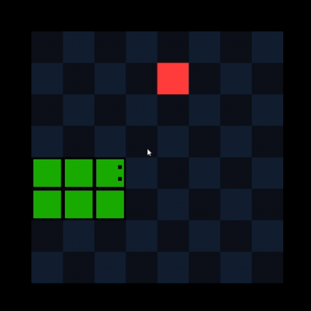

# 🐍 Snake (Yes, *That* Snake)

<div align="center">
  
</div>

---

It’s the classic snake game.

Not a reinvention.  
Not a cinematic universe.  
Not a battle royale.

Just a snake.  
Made by me.

You move.  
You eat.  
You grow.  
You crash into yourself.  

Tradition is important.

---

<h1 align="center">🐍 Generic Snake Game™</h1>

<div align="center">
  
</div>

---

## 🎮 What Is This Masterpiece?

This is:

- The typical snake game
- On a grid
- With food
- And walls
- And consequences

If you’ve ever owned:
- A Nokia
- A calculator
- A browser
- A computer
- A device with electricity

You already understand the mechanics.

But this one?
This one was coded by me.

So it has personality.

---

## 🧠 Revolutionary Features

- Snake moves
- Snake turns
- Snake grows
- Snake dies

I didn’t reinvent the wheel.

I just made sure it rolls correctly.

---

## ▶️ How to Play

1. Download the build from the **Releases** section.
2. Run it.
3. Pretend you’ve never played Snake before.
4. Immediately realize you have.

---

## ⌨️ Controls

- Arrow Keys / WASD — Move
- Confidence — Temporary
- Ego — Fragile

---

## 📦 Project Status

- 🐞 Bugs? Possibly.
- 🐍 Snake? Definitely.
- 🎨 AAA Budget? No.

---

## 🗂 Project Structure

```text
Assets/
│
├─ Animation/
│   └─ Controllers/
│
├─ Prefabs/
├─ Sprites/
├─ Tilemap/
│
├─ Scripts/
│   ├─ Game/
│   ├─ Gameplay/
│   └─ UI/
│
Media/
```

## 🏆 Why Does This Exist?

Because every programmer must, at some point, make:

- A calculator

- A to-do list

- A snake game

This is mine.